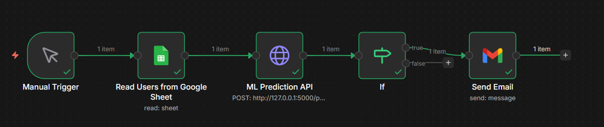
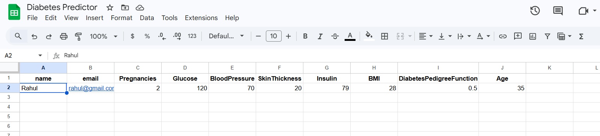
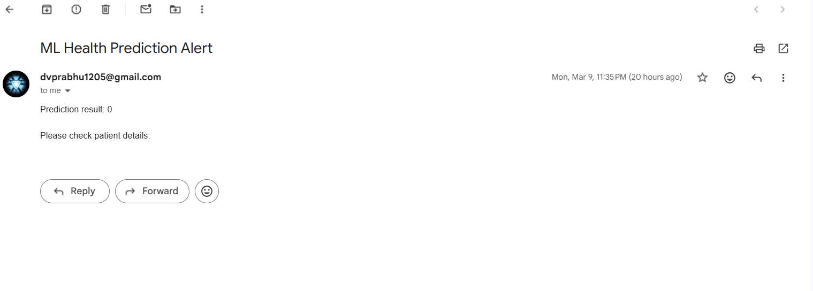

# 🩺 Diabetes Prediction System using Machine Learning & n8n Automation

## 📌 Project Overview

This project is an automated **Diabetes Risk Prediction System** that uses a Machine Learning model to predict whether a person is likely to have diabetes based on medical parameters.  

The system integrates **workflow automation using n8n**, where patient data is collected from **Google Sheets**, processed through the ML model, and the prediction result is automatically used to trigger an **email alert if a diabetes risk is detected**.

This project demonstrates the integration of **Machine Learning, API-based automation, and workflow orchestration** to build a real-world intelligent healthcare monitoring system.

---

## 🎯 Problem Statement

Diabetes is one of the most common chronic diseases worldwide. Early prediction can help individuals take preventive measures and consult medical professionals before the condition becomes severe.

This project aims to:

- Predict diabetes risk using machine learning
- Automate the data processing pipeline
- Generate alerts for high-risk cases
- Demonstrate an AI-powered automation workflow

---

## 🧠 Machine Learning Model

The ML model is trained using the **PIMA Indians Diabetes Dataset**, which contains medical attributes used to predict diabetes.

### Input Features

The model uses the following health parameters:

- Pregnancies
- Glucose Level
- Blood Pressure
- Skin Thickness
- Insulin Level
- Body Mass Index (BMI)
- Diabetes Pedigree Function
- Age

### Target Variable

- **Outcome**
  - `0` → No Diabetes
  - `1` → Diabetes Risk

The dataset is processed using **Python and Scikit-learn**, and a classification model is trained to predict the outcome.

---
## 📷 Project Demo Images

### n8n Workflow



### Google Sheet Data



### Email Alert



---

### ⚙️ System Workflow

```
Google Sheets
      ↓
n8n Workflow
      ↓
HTTP Request
      ↓
Machine Learning Prediction
      ↓
Prediction Result
      ↓
IF Condition (Risk Detection)
      ↓
Email Notification
```
---

## 🔄 Workflow Explanation

### 1️. Data Collection

User health data is stored in **Google Sheets**.  
Each row represents a patient's health parameters.

---

### 2️. Workflow Automation (n8n)

The automation platform **n8n** reads the patient data from Google Sheets and processes it through a workflow pipeline.

Key workflow nodes:

- Google Sheets Node → Reads patient data
- HTTP Request Node → Sends data to ML prediction system
- IF Node → Checks prediction result
- Gmail Node → Sends alert email if diabetes risk is detected

---

### 3️. Machine Learning Prediction

The ML model processes the patient health data and predicts whether the patient has diabetes risk.

Prediction output:

- `0` → No Diabetes
- `1` → Diabetes Risk

---

### 4️. Risk Detection Logic

The **IF condition in n8n** evaluates the ML prediction:

If prediction == 1

Send Email Alert

Else

No action required

---

### 5️. Email Notification

If the system detects diabetes risk, an automated email notification is sent to inform the user.

This helps provide **early warning and preventive awareness**.

---

## 🛠 Technologies Used

- Python
- Pandas
- Scikit-learn
- n8n Workflow Automation
- Google Sheets API
- Gmail API
- JSON Workflow Integration

---

## 📂 Project Structure

```
diabetes-prediction-ml-n8n
│
├── dataset
│   └── diabetes.csv
│
├── model
│   ├── train_model.py
│   └── diabetes_model.pkl
│
├── n8n-workflow
│   └── diabetes_predictor_workflow.json
│
├── screenshots
│   ├── workflow.png
│   ├── sheet-data.png
│   └── email-alert.png
│
├── requirements.txt
└── README.md
```

---

## 🚀 How to Run the Project

### Install Dependencies
pip install -r requirements.txt

---

### Train the Machine Learning Model
python train_model.py

---

### Start n8n
n8n start

Open the n8n interface:
http://localhost:5678

Import the workflow JSON file and run the automation.

---

## 📊 Dataset

The dataset used in this project is the **PIMA Indians Diabetes Dataset**, which is commonly used for medical ML classification problems.

Dataset source:
https://raw.githubusercontent.com/plotly/datasets/master/diabetes.csv

---

## 🔮 Future Improvements

Possible improvements for this system include:

- Deploying the ML model on AWS
- Creating a web interface for user input
- Improving model accuracy with advanced algorithms
- Adding real-time health monitoring
- Integrating mobile notifications

---

## 📜 Conclusion

This project demonstrates how **Machine Learning can be combined with workflow automation tools like n8n to build intelligent decision-support systems**.  

The automated pipeline enables efficient data processing, prediction, and alert generation, making it a practical example of **AI-powered healthcare automation**.

---
